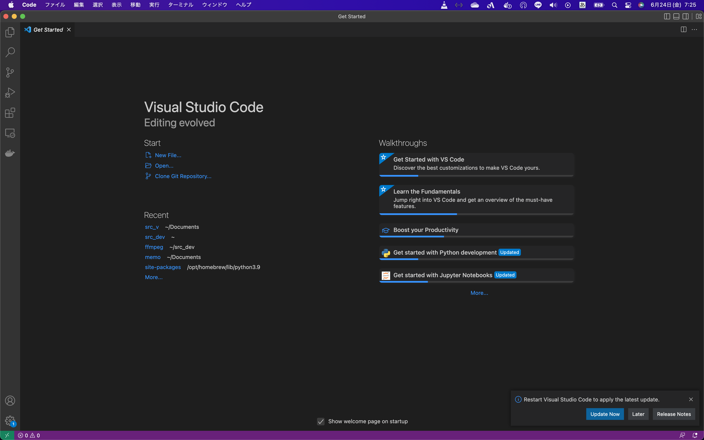
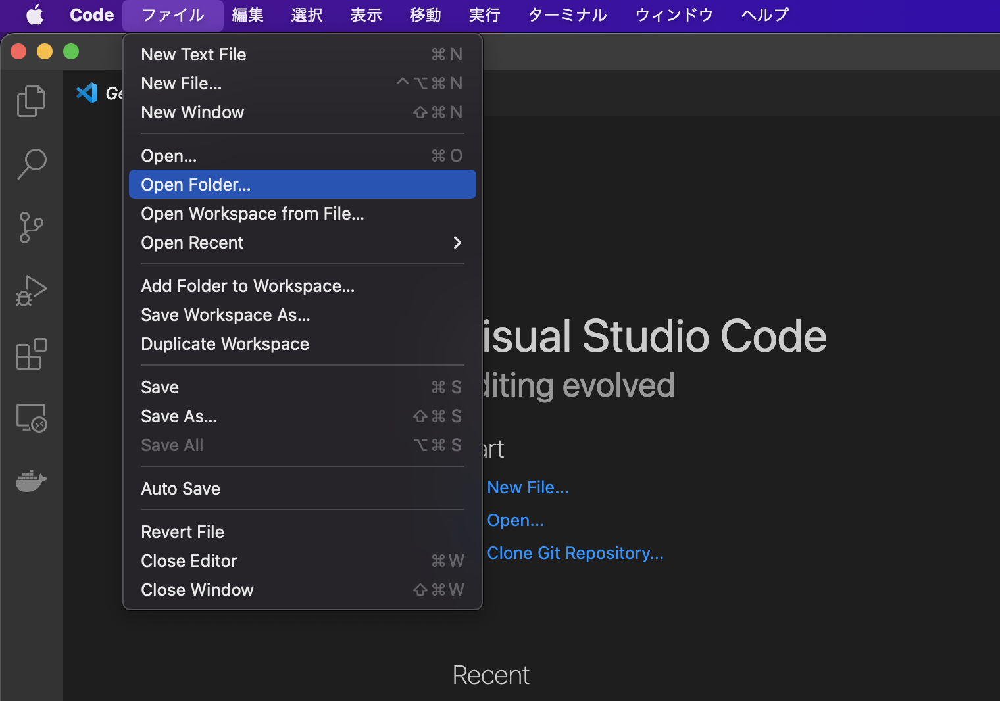
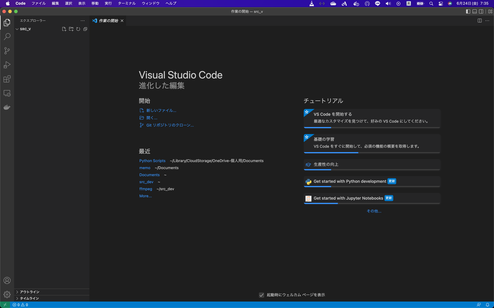
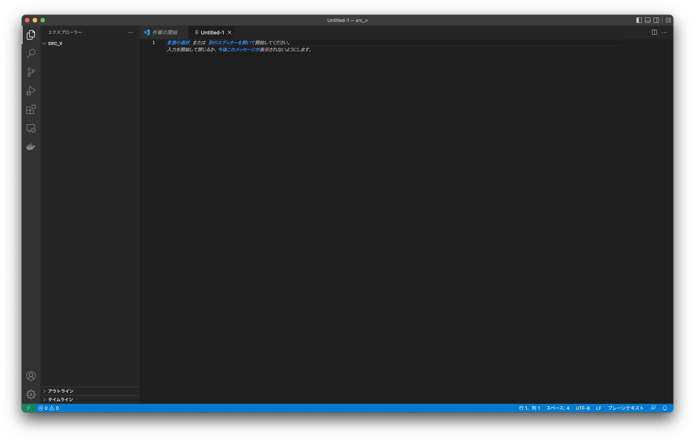
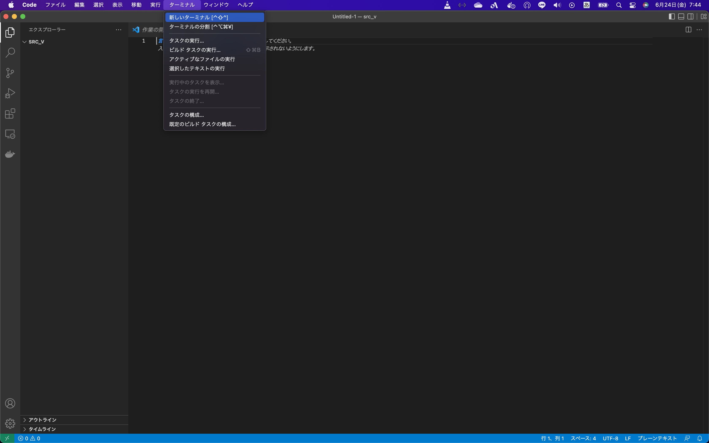
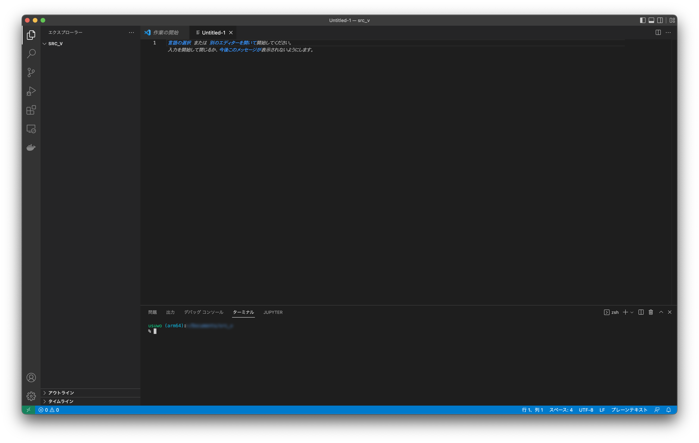

# Pythonによる数値分析環境の整え方 <div style="font-size:9pt;text-align:right;">2022/06/23 Marpyong</div>

## 1.Intoroduction
MatLabと同等かつ、それ以上(高度な推定・分類モデル作成)が可能な
環境を構築する方法を記載致します。

## 2.OSを破壊しない為の環境の構築
一般的にMacにはPythonが標準でインストールされており、OSにも使われています。  
これは、Libraryを導入して行く中で、致命的な破壊を起こすことと隣り合わせでもあります。  

そこで、OSの動作とは別に仮想的なPython環境を構築することで、  
OSの動作に干渉せずにPythonを利用することが出来る環境の構築を目指します。

### 2.1 作業ディレクトリの作成とVSCodeでのターミナル立ち上げ
まずは、どこでも良いですのでソースを管理するフォルダーを作成して下さい  

> ポイント  
> このとき、Path(ディレクトリの場所を示すやつ。```/home/hogehoge/Documents```的な。)に、  
> 日本語の文字列や全角の文字が入らない様に注意して下さい。)  

次に、VSCodeでそのディレクトリを開きます。  
VSCodeを立ち上げると、このような画面が出ると思います。


開いたら、
メニューバーのファイル->Open Folder...  (フォルダーを開くと書いてあるかも)を選択し、
先ほど作った作業ディレクトリを選択して開いてください。  


ひらくと、VSCodeが一旦閉じて再度、このような画面で開くと思います。


VSCodeは開発環境兼テキストエディタですので、
この状態で```command+n```を押下すると、文字入力のタブが開かれます。


ここにメモ等をして、保存する場合は```command+s```で保存出来ます。  
では、本題のターミナルをひらいていきましょう。  
```メニューバー->ターミナル->新しいターミナル```を選択するか、  

```control+shift+@```を入力すると、、、

このような観じでターミナルが開きます。  
これ以降ターミナルに打つ時に、コレを活用することも念頭に入れてみて下さい。

ターミナルを閉じるには、右側中段のゴミ箱マークをクリックします。

### 2.2 venvによる仮想環境作成
OSの動作とは別に仮想的なPython環境を提供する為のツールとして、  
venvを導入します。
ターミナルに下記を入力してください。

```sh
python3 -m venv venv
```

これで仮想環境の作成は成功です。
入力直後に命令入力可能となるので、次のコマンドを入力します。
```sh
source venv/bin/activate
```

そうすると、ターミナルの入力可能を示す文字列の前に、  
```(venv)```という文字列が追加されると思います。
これで仮想環境の有効化も成功です。

以降ターミナルを開く前に、必ず
```sh
source venv/bin/activate
```
を打つ様にしましょう。
これにて、OSを破壊しない為の環境の構築は成功です。

## 3.いろいろインストール。
### 3.1.いろいろ必要そうなものをインストール
必要なものを怒濤如くインストールしてきます。  
まずは、数値計算・グラフ作成・画像化・いろいろに必要なツールから。
```sh
pip install numpy scipy matplotlib Pillow ipython
```

### 3.2.jupyter
jupyter(なんかメモとか挟みながらpython実行出来る様にするやつ)をインストールします。
ターミナルに以下を打ち込みます。
```sh
pip install jupyter
```

VSCodeでJupyter Notebookを開きます。  
[このページ](https://dev.classmethod.jp/articles/visual-studio-code-jupyter-notebook/)なんかを参考にすると良いでしょう。


## 4.あとがき
とりあえず、必要そうなものはこんな感じでインストールして行きます。  
なんか分からない事だらけだと思うので、適宜質問をして下さいな。
